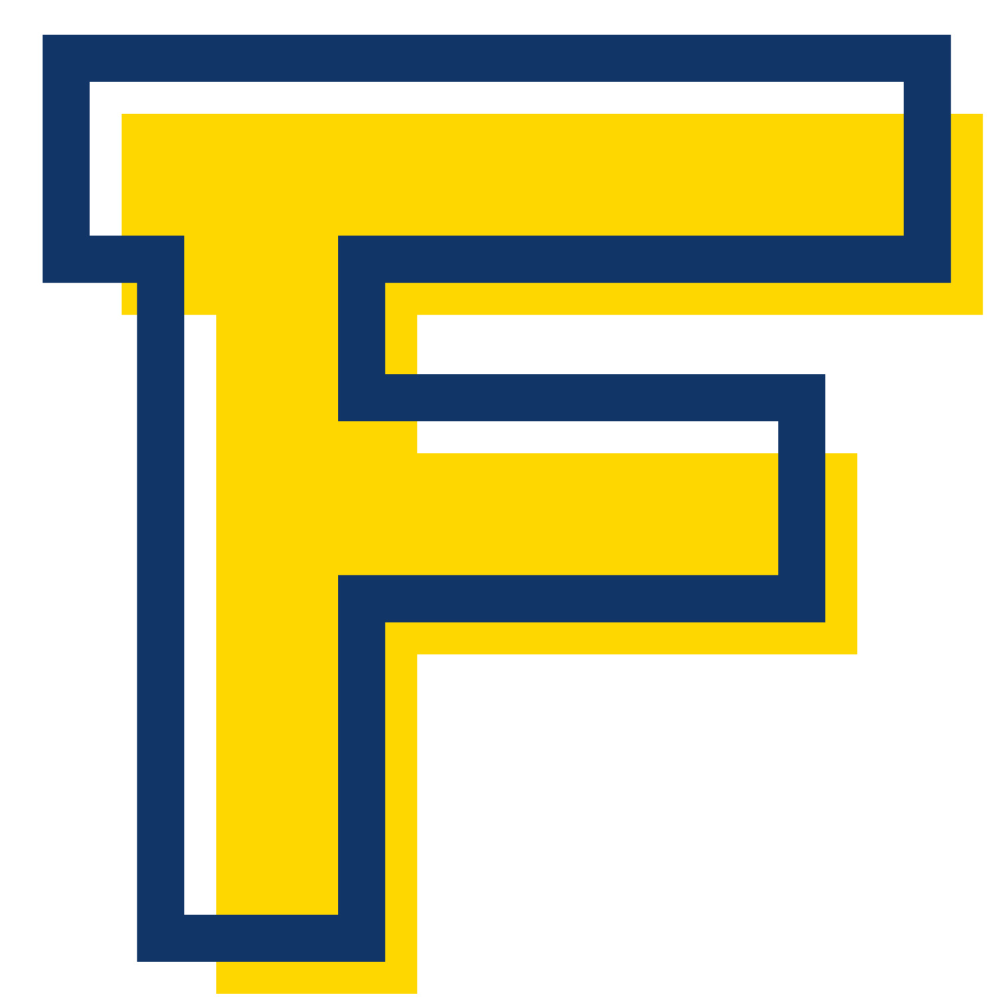

# <h1 align="center">Portifolio</h1>

  
<h1 align="center">
  
</h1>

  
  
  
  
  
  
  
  
  

## 🚀 Tecnologias

Esse projeto foi desenvolvido com as seguintes tecnologias:

- Html
- Javascript
- Scss

## :information_source: Descrição:

O projeto tem o intuito de apresentar meu Portifolio

## :eyes: Confira

Você pode acessar por aqui:

-  [Portifolio][demo]

<h4 align="center">
    Feito com ♥ por Flavio Tobias 👋 <a href="https://www.linkedin.com/in/flaviotobias/" target="_blank">Entre em contato!</a>
</h4>

[demo]: https://portifolio-flavio.netlify.app/
